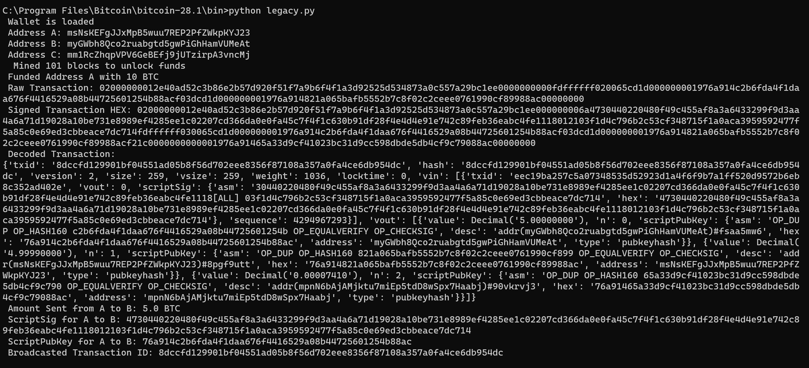
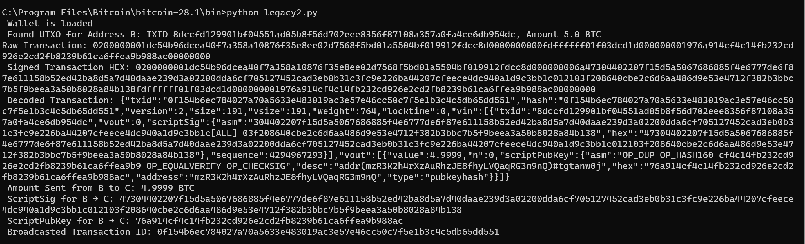
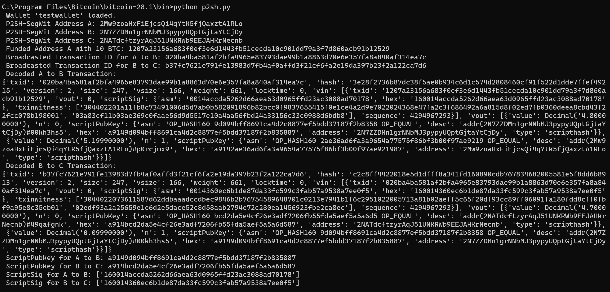
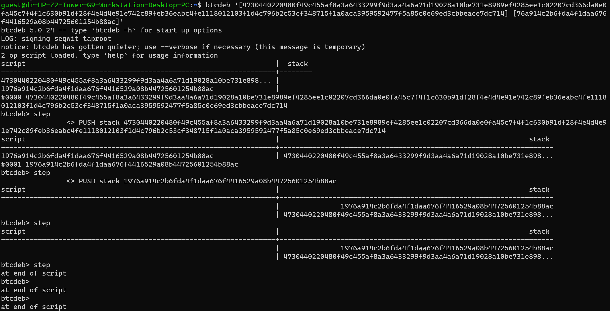
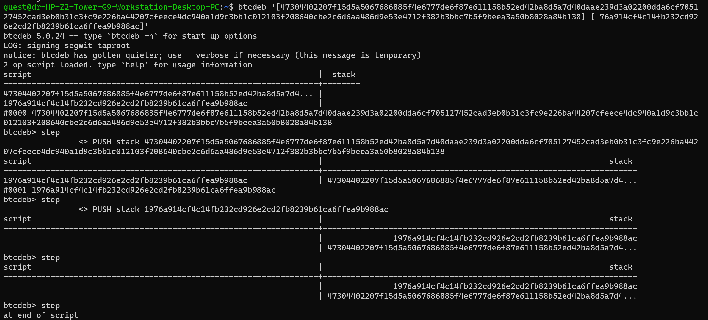
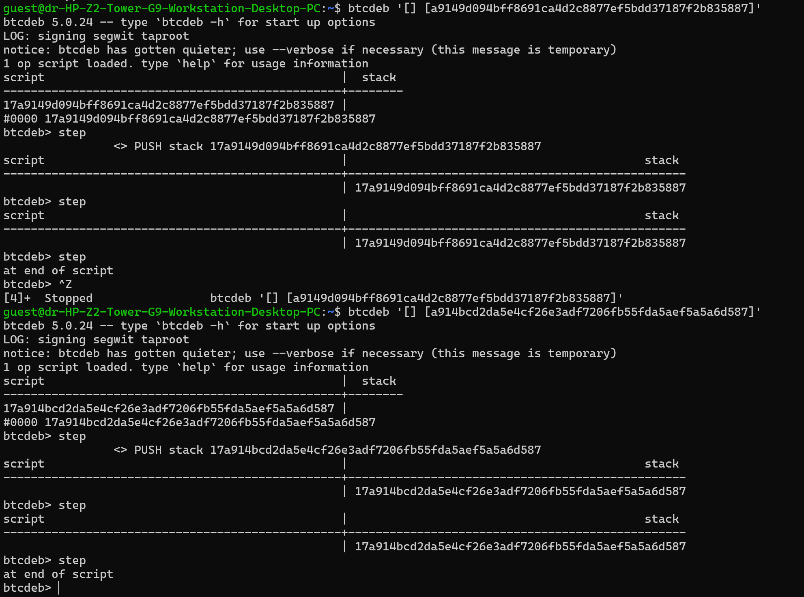

#Bitcoin-Scripting

##Team
Team-name: CryptoCrew 
Annamareddi Suhitha - cse230001008, 
Polathala Bhavana - mc230041026, 
Vangapally PranavaReddy - mc230041037.

## Description

This project demonstrates the process of creating, signing, and broadcasting Bitcoin transactions on a Bitcoin Core regtest network using Python scripts. It includes sending transactions between addresses, mining blocks to confirm transactions, and debugging them using btcdeb.

## Features

- Automated Bitcoin transaction creation and signing.
- Uses Bitcoin Core's bitcoind in regtest mode.
- Generates addresses and manages wallets.
- Implements UTXO handling and change outputs.
- Debugging transactions with btcdeb.

## Prerequisites

1. *Install Bitcoin Core*
   - Download from [Bitcoin Core official site](https://bitcoincore.org/)
   - Install and configure bitcoind
2. *Install Python and Dependencies*
   - Python 3.x is required
   - Install dependencies using:
     sh
     pip install python-bitcoinrpc requests
     
3. *Bitcoin Configuration File (*bitcoin.conf*\\\\\\\\\\\\\\\\\\\\\\\\\\\\\\\\\\\\\\\\\\\\\\\\\\\\\\\\\\\\\\\\\\\\\\\\\\\\\\\\\\\\\\\\\\\\\\\\)*
   Ensure bitcoin.conf contains:
   ini
   regtest=1
   server=1
   rpcuser=Cryptocrew
   rpcpassword=abc123
   txindex=1
   fallbackfee=0.0002
   mintxfee=0.00001
   paytxfee=0.0001
   txconfirmtarget=6
   

## Execution Steps

### 1. Start Bitcoin Regtest Mode

sh
bitcoind -regtest -daemon

Verify if bitcoind is running:

sh
bitcoin-cli -regtest getblockchaininfo

### 2. Run the First Script (P2PKH Transactions)

sh
python first_script.py

- Generates three legacy addresses (A, B, C)
- Mines 101 blocks to unlock coinbase rewards
- Funds Address A and performs transactions
- Debug transactions

### 3. Change Address B in second_script.py

Before running second_script.py, replace Address B in the script with the output from the first script.

### 4. Run the Second Script (Continuing Transactions)

sh
python legacy2.py

- Retrieves UTXO for Address B
- Sends funds from B to C
- Debug transactions

### 5. Debug The Transactions

sh
btcdeb '[scriptSig] [scriptPubKey]'

Then, step through with:

sh
btcdeb > step #continue till end

### 6. Restart bitcoind and Run the Third Script

Stop and restart bitcoind:

sh
bitcoin-cli -regtest stop
bitcoind -regtest 

Then execute:

sh
python p2sh.py

- Uses P2SH-SegWit transactions
- Sends transactions between new addresses (A', B', C')
- Mines blocks for confirmation

### 7. Debug the Third Script Transactions

To debug  the  transactions:

sh
btcdeb '[] [scriptPubKey]'

Step through with:

sh
btcdeb > step #continue till end

## Interpretation of Transactions

1. *Legacy Transaction(1st and 2nd scripts)*
   - Uses P2PKH (Pay-to-PubKey-Hash)
   - Requires scriptSig with a public key and signature
2. *SegWit Transactions (3rd Script)*
   - Uses P2SH-SegWit (Pay-to-Script-Hash with Segregated Witness)
   - Script execution differs, with witness data in separate fields

By following these steps, you can successfully execute and debug Bitcoin transactions in regtest mode.

## Sample Output Snippets
Legacy transaction from A to B

Legacy transaction from B to C

Segwit transaction from A to B and B to C 

Legacy Debug for transaction A to B

Legacy Debug for transaction B to C

Segwit Debug for transaction A to B and B to C

